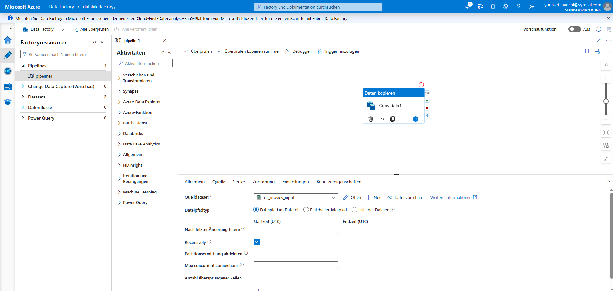
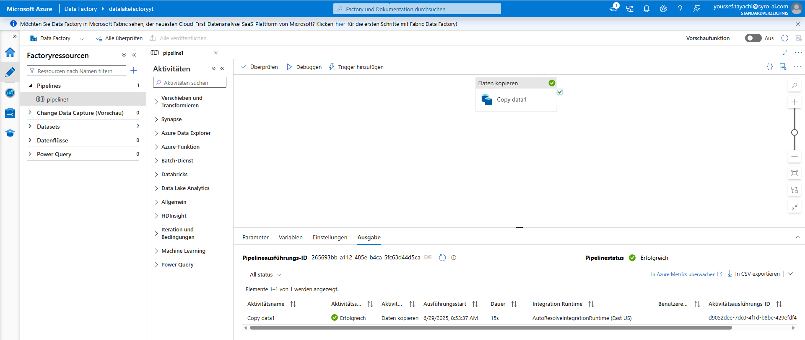

# Azure Data Factory Demo – CSV File Copy Pipeline

This is a simple beginner-level project demonstrating how to copy a `.csv` file from one folder to another within an Azure Data Lake Storage Gen2 container using **Azure Data Factory (ADF)**.

The goal is to understand the basics of data pipelines and how ADF integrates with Azure Storage to orchestrate movement of data – a fundamental task in modern Data Engineering.

---

## 🛠 Technologies Used

- Azure Data Factory
- Azure Data Lake Storage Gen2
- Azure Portal
- CSV files
- Azure Resource Manager (ARM)
- Git & Visual Studio Code (for documentation)

---

## 📁 Folder Structure

A container was created in Azure Data Lake called `raw`, with the following folder layout:

```
raw/
├── input/
│   └── movies.csv
└── processed/
    └── movies_copied.csv (created by the pipeline)
```

---

## 🎯 What This Pipeline Does

- Takes the `movies.csv` file from `raw/input/`
- Copies it as `movies_copied.csv` to `raw/processed/`
- Uses a **Copy Activity** in a simple pipeline with source and sink datasets

This simulates an **EL** (Extract & Load) step, which is a basic building block in any ETL/ELT pipeline.

---

## 📸 Screenshots

### 🔹 Azure Data Lake Structure  
Shows the folder setup inside the storage account.


---

### 🔹 Azure Data Factory Pipeline  
Visual of the Copy Activity inside the pipeline editor.



---

### 🔹 Successful Pipeline Execution  
ADF run showing the successful execution status and duration.



---

## 💡 Why This Matters

Copying data between locations may seem basic, but it's an essential part of any automated data platform. Learning this pipeline is the first step toward:

- Automating ingestion of raw data
- Preparing for transformation tasks
- Connecting to tools like Azure Synapse, Databricks, Power BI, etc.

---

## 📂 Pipeline JSON Export

The full pipeline is available as an exported `.json` template [here](./adf_export/pipeline1.json), which can be imported directly into another ADF instance.

---

## 📌 Author

**Youssef Tayachi** 
